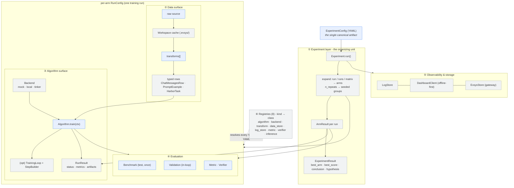
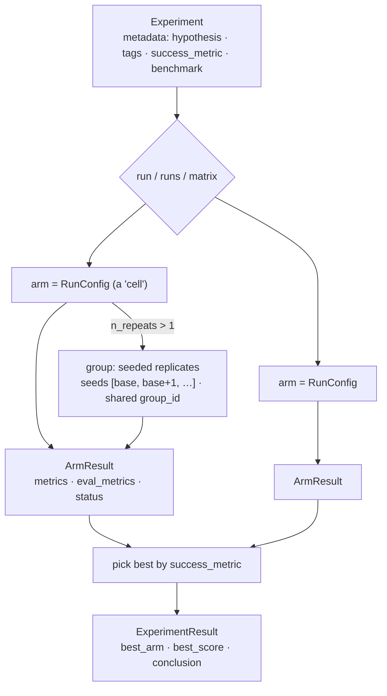
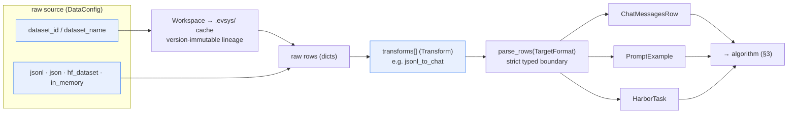
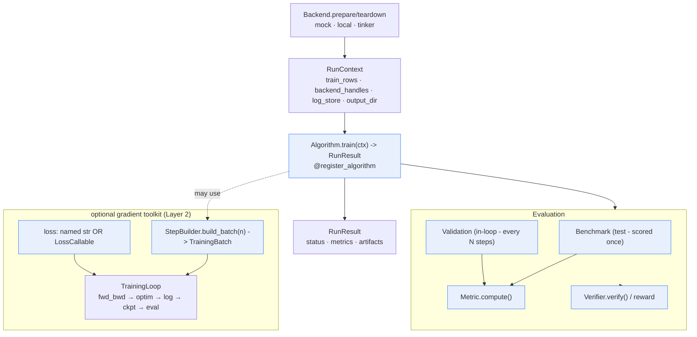
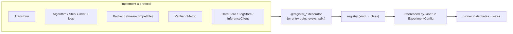
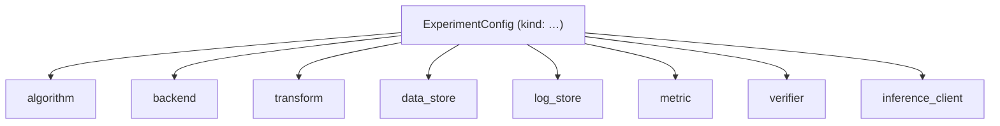

# evsys-sdk - architecture overview

A whitepaper-style tour of the SDK's top-level components: the **Experiment**
(the organizing unit), the **Data** surface, the **Algorithm** surface, and the
**registries** that make every piece pluggable. Each section pairs prose with a
mermaid diagram.

---

## 0. The whole system at a glance

> Blue = things the **user** authors/implements. Grey = things the **SDK**
> owns. One `ExperimentConfig` ties it all together; every `kind:` in it
> resolves through a registry.

---

## 1. The organizing unit - the Experiment

The Experiment is the scientific container: a **hypothesis**, one or more
**training runs**, and an auto-synthesized **conclusion**.

**Vocabulary**

- **Experiment** - the top-level study. `Experiment.from_yaml(...).run()` owns
  dashboard experiment/run creation, sweep expansion, per-arm failure
  isolation, post-train scoring, metric forwarding, and conclusion building.
- **Training run (arm)** - one `RunConfig` = one concrete training job (one
  cell of a sweep). `runs` / `matrix` produce many arms.
- **Run group** - `n_repeats > 1` replicates an arm across seeds (shared
  `group_id`) so variance is a config field, not a bespoke script.
- **Hypothesis → success_metric → conclusion** - the loop: the hypothesis is
  the question; `success_metric` ranks arms into `best_arm`; the `conclusion`
  summarizes the outcome. All recorded on the dashboard.

**Config objects**

| Object | Role |
|---|---|
| `ExperimentConfig` | top level: `name`, `output_dir`, stores, one of `run`/`runs`/`matrix`, `n_repeats`/`base_seed`, `parent_experiment_id`, `metadata` |
| `RunConfig` | one run: `data`, `model`, `algorithm`, `backend`, `eval`, `validation`, `seed`, `tags` - the cell the two surfaces plug into |
| `MatrixSpec` / `Sweep` | cartesian expansion over dotted-path axes → many `RunConfig`s via one `expand_runs()` |
| `ExperimentResult` / `ArmResult` | outputs: per-arm metrics + the experiment-level `best_arm`, `conclusion`, `hypothesis` |

> Two runners: **`Experiment`** (OOP, with dashboard bookkeeping) wraps
> **`run_experiment(cfg)`** (the inner per-arm runner - use it directly to
> train without bookkeeping).

---

## 2. Data surface - raw → transforms → standardized formats

Standardize *anything* into a few typed shapes, then hand those to the
algorithm. Tokenization/supervision live below this boundary.

- **User defines:** a `DataConfig` (source + `transforms`), and a custom
  `Transform` when built-ins don't fit. Picks which typed format the algorithm
  consumes.
- **SDK handles:** loading, pull/cache-by-id with lineage (`Workspace`),
  running transforms in order, strict `parse_rows` conversion.

| Class | Implementable? | Contract |
|---|---|---|
| `DataConfig` | author in YAML | source + `transforms[]` |
| **`Transform`** | **yes** (`@register_transform`) | `__call__(rows) -> rows` + `Config` |
| `ChatMessagesRow` / `PromptExample` / `HarborTask` | choose shape | **data only - no supervision encoded** |
| `DataStore` | rarely | `read_jsonl/write_jsonl/read_json/write_json/exists/list` |
| `Workspace` / `MaterializedDataset` | no (SDK) | pull / cache / lineage |

---

## 3. Algorithm surface - Algorithm, Evaluation, Metrics

One required contract (`train(ctx) -> RunResult`) plus an optional gradient
toolkit and pluggable evaluation.

### 3.1 Algorithm
- **`Algorithm`** (protocol): `name`, `Config`, `train(ctx) -> RunResult`. The
  only required contract - `train()` may do anything.
- **Optional toolkit:** `TrainingLoop` drives the gradient loop; a `StepBuilder`
  (`build_batch -> TrainingBatch`) is the unit of "a new gradient method";
  losses are a **named string** or a **`LossCallable`** (client-side, via
  `forward_backward_custom`).

### 3.2 Evaluation (two tiers - a test/validation firewall)
- **Benchmark** - the *test set*, scored **once after** training; model
  selection must never key off it.
- **Validation** - scored **in-loop** every N steps to drive selection.
- Both harbor-format; scored via the **Metric** / **Verifier** registries.

### 3.3 Metrics & Verifiers
- **`Metric`**: `compute(predictions, targets) -> float`.
- **`Verifier`**: `verify(prompt, completion, target) -> reward` (RL reward /
  per-task scoring).
- **`InferenceClient`**: `generate(...)` - how eval/RL query a model.

---

## 4. Customizability & main design

The recurring pattern - **implement a protocol → register under a `kind` →
reference it in YAML.** No subclassing the library; no fork.

**Any tinker-compatible backend.** Two backend notions:
- **Framework `Backend`** (`prepare()/teardown()`) - selected by
  `backend.kind`; provisions compute, doesn't train.
- **Training `Backend`** (the loop's executor) - `forward_backward_async`,
  `forward_backward_custom_async`, `optim_step_async`,
  `snapshot_sampling_client`, `get_tokenizer`. **"Tinker-compatible" = implement
  this protocol;** `TrainingLoop` then runs unchanged (a `MockBackend` proves
  it in tests).

| Surface | Implement | Register |
|---|---|---|
| reshape data | `Transform` | `@register_transform` |
| new storage | `DataStore` | `@register_data_store` |
| new method | `Algorithm` (+ `StepBuilder`/loss) | `@register_algorithm` |
| new compute | `Backend` | `@register_backend` |
| reward / scoring | `Verifier` / `Metric` | `@register_verifier` / `@register_metric` |
| generation | `InferenceClient` | `@register_inference` |
| metric sink | `LogStore` | `@register_log_store` |

---

## 5. The registries

One registry per extension point. The YAML `kind` resolves into it, and
`schema_for(kind, name)` exposes the legal `params` (used by evolutionary
search to mutate configs safely).

| Registry | Decorator | `kind` used in |
|---|---|---|
| algorithm | `@register_algorithm` | `run.algorithm.kind` |
| backend | `@register_backend` | `run.backend.kind` |
| transform | `@register_transform` | `data.transforms[].kind` |
| data_store | `@register_data_store` | `data_store.kind` |
| log_store | `@register_log_store` | `log_store.kind` |
| metric | `@register_metric` | `eval.metrics[]` / `validation.metrics[]` |
| verifier | `@register_verifier` | verifier specs / RL reward |
| inference_client | `@register_inference` | `eval.inference.kind` (+ per-backend default factories) |

---

## Summary

The **Experiment** carries a hypothesis, expands into one or more **training
runs** (`RunConfig` arms, optionally seeded into variance **groups**), and
produces a **best_arm** + **conclusion** against a `success_metric`. Each run
plugs together two surfaces: the **data surface** turns raw, lineage-cached
sources through ordered `Transform`s into standardized typed rows that carry
only data; the **algorithm surface** is one contract - `Algorithm.train(ctx) ->
RunResult` - with an optional `TrainingLoop`/`StepBuilder` toolkit for gradient
methods over any tinker-compatible `Backend`, plus pluggable `Evaluation`,
`Metric`, and `Verifier`. Everything is a protocol registered under a `kind`
across eight registries, so users (and third-party packages) extend the system
without forking it.
