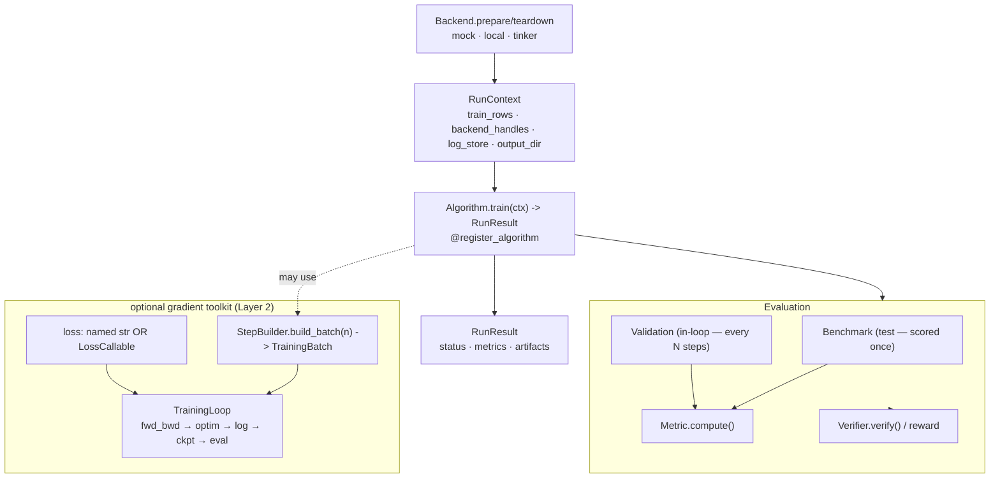

The algorithm surface is **one required contract** (`train(ctx) -> RunResult`)
plus an optional gradient toolkit and pluggable evaluation. It runs over any
tinker-compatible `Backend` — `mock` for tests, `local` for TRL+peft, `tinker`
for hosted.

## Algorithm

`Algorithm` (protocol): `name`, `Config`, `train(ctx) -> RunResult`. The only
required contract — `train()` may do anything. The optional toolkit:
`TrainingLoop` drives the gradient loop; a `StepBuilder` (`build_batch ->
TrainingBatch`) is the unit of "a new gradient method"; losses are a **named
string** or a **`LossCallable`** (client-side, via `forward_backward_custom`).

## Evaluation — a test/validation firewall

- **Benchmark** — the *test set*, scored **once after** training. Model
  selection must never key off it.
- **Validation** — scored **in-loop** every N steps to drive selection.
- Both are harbor-format and scored via the **Metric** / **Verifier** registries.

## Metrics & Verifiers

- **`Metric`**: `compute(predictions, targets) -> float`.
- **`Verifier`**: `verify(prompt, completion, target) -> reward` (RL reward or
  per-task scoring).
- **`InferenceClient`**: `generate(...)` — how eval/RL query a model.

<Callout type="warn" title="Keep the firewall intact">
A `Benchmark` is your held-out test. If you select the best arm using
benchmark scores, you've leaked the test set — use `Validation` for selection.
</Callout>

Next: [Extensibility](/docs/concepts/extensibility) ·
[algorithms API](/docs/evsys_sdk/algorithms).
