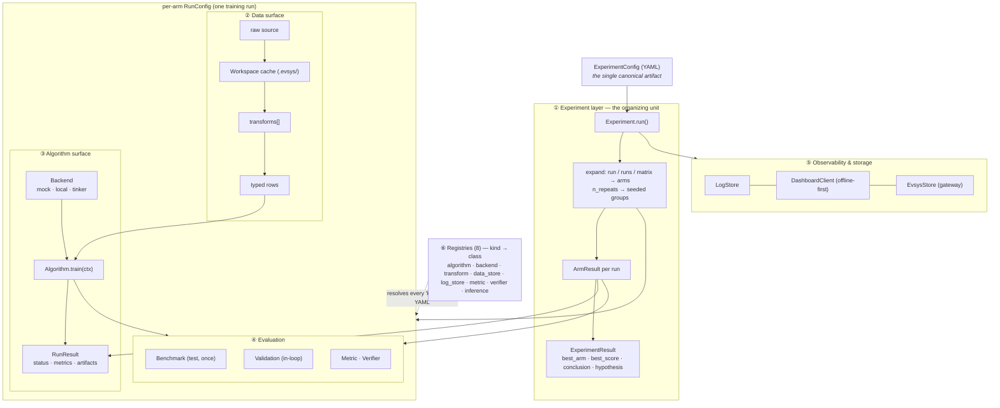

`evsys-sdk` is organized around a single idea: **one `ExperimentConfig` (YAML)
drives everything**, and every `kind:` in it resolves through a registry. The
diagram below is the whole system on one screen — blue is what *you* author,
grey is what the *SDK* owns.

> **Blue = things you author/implement. Grey = things the SDK owns.** One
> `ExperimentConfig` ties it all together; every `kind:` in it resolves through
> a registry.

## The five layers

| Layer | What it does | Start here |
| --- | --- | --- |
| **① Experiment** | The organizing unit — a hypothesis, one or more runs, an auto-synthesized conclusion. | [Experiments](/docs/concepts/experiments) |
| **② Data** | Raw sources → ordered transforms → standardized typed rows. | [Data](/docs/concepts/data) |
| **③ Algorithm** | One contract — `train(ctx) -> RunResult` — over any tinker-compatible backend. | [Algorithms](/docs/concepts/algorithms) |
| **④ Evaluation** | A test/validation firewall: `Benchmark` (once) vs `Validation` (in-loop). | [Algorithms](/docs/concepts/algorithms) |
| **⑤ Extensibility** | Eight registries — implement a protocol, register a `kind`, reference it in YAML. | [Extensibility](/docs/concepts/extensibility) |

Everything below this page drills into one layer. If you just want to run
something, jump to the [Quickstart](/docs/quickstart).
