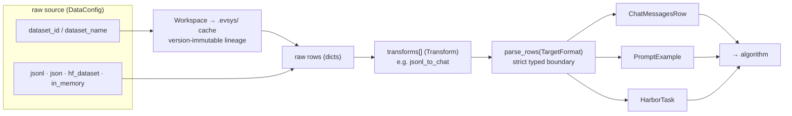

The data surface standardizes *anything* into a few typed shapes, then hands
those to the algorithm. Tokenization and supervision live **below** this
boundary — the typed rows carry only data; the algorithm decides what's a
target token.

- **You define:** a `DataConfig` (source + `transforms`), and a custom
  `Transform` when the built-ins don't fit. You pick which typed format the
  algorithm consumes.
- **The SDK handles:** loading, pull/cache-by-id with lineage (`Workspace`),
  running transforms in order, and the strict `parse_rows` conversion.

| Class | Implementable? | Contract |
|---|---|---|
| `DataConfig` | author in YAML | source + `transforms[]` |
| **`Transform`** | **yes** (`@register_transform`) | `__call__(rows) -> rows` + `Config` |
| `ChatMessagesRow` / `PromptExample` / `HarborTask` | choose shape | **data only — no supervision encoded** |
| `DataStore` | rarely | `read_jsonl` / `write_jsonl` / `read_json` / `write_json` / `exists` / `list` |
| `Workspace` / `MaterializedDataset` | no (SDK) | pull / cache / lineage |

<Callout title="The dataset-format rule">
Data formats hold only data. **The algorithm decides which tokens are
targets** — the same `ChatMessagesRow` can be used for SFT or as an RL prompt.
</Callout>

Next: [Algorithms](/docs/concepts/algorithms) ·
[data types reference](/docs/evsys_sdk/data_types).
