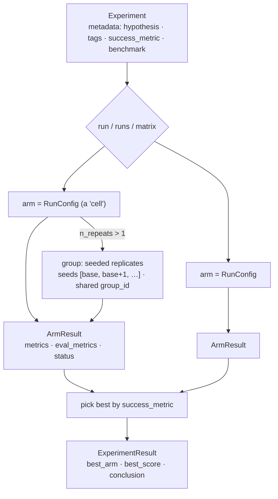

The **Experiment** is the scientific container: a **hypothesis**, one or more
**training runs**, and an auto-synthesized **conclusion**. It's the top of the
spine - `config.yaml → Experiment → arms → backend → eval → artifacts`.

```python
from evsys_sdk import Experiment

Experiment.from_yaml("config.yaml").run()
```



## Vocabulary

- **Experiment** - the top-level study. `Experiment.from_yaml(...).run()` owns
  dashboard experiment/run creation, sweep expansion, per-arm failure
  isolation, post-train scoring, metric forwarding, and conclusion building.
- **Training run (arm)** - one `RunConfig` = one concrete training job (one
  cell of a sweep). `runs` / `matrix` produce many arms.
- **Run group** - `n_repeats > 1` replicates an arm across seeds (shared
  `group_id`) so variance is a config field, not a bespoke script.
- **Hypothesis → success_metric → conclusion** - the hypothesis is the
  question; `success_metric` ranks arms into `best_arm`; the `conclusion`
  summarizes the outcome. All recorded on the dashboard.

## Config objects

| Object | Role |
|---|---|
| `ExperimentConfig` | top level: `name`, `output_dir`, stores, one of `run`/`runs`/`matrix`, `n_repeats`/`base_seed`, `parent_experiment_id`, `metadata` |
| `RunConfig` | one run: `data`, `model`, `algorithm`, `backend`, `eval`, `validation`, `seed`, `tags` - the cell the two surfaces plug into |
| `MatrixSpec` / `Sweep` | cartesian expansion over dotted-path axes → many `RunConfig`s via one `expand_runs()` |
| `ExperimentResult` / `ArmResult` | outputs: per-arm metrics + the experiment-level `best_arm`, `conclusion`, `hypothesis` |

<Callout title="Two runners">
**`Experiment`** (OOP, with dashboard bookkeeping) wraps
**`run_experiment(cfg)`** (the inner per-arm runner). Use `run_experiment`
directly to train without bookkeeping.
</Callout>

## Continual learning

`continual` is a **modifier** (not a fourth mode) on top of a single `run`: give
it an ordered list of `datasets`, and the base run trains **once per dataset, in
order**, with each stage starting from the **previous stage's weights** - a fresh
optimizer initialised via `init_from_checkpoint`. All stages live in one
experiment and each is scored on every benchmark, so you watch the model
accumulate skills dataset by dataset.

```yaml
run:                       # the base recipe; its own `data` is ignored
  model: { name: Qwen/Qwen3.5-4B }
  algorithm: { kind: sft }
continual:
  datasets:                # one training stage per entry, chained in order
    - { dataset_name: corpus_a, transforms: [...] }
    - { dataset_name: corpus_b, transforms: [...] }
    - { dataset_name: corpus_c, transforms: [...] }
```

This is the SDK's built-in **continually-learning** primitive: weights chain
forward so each stage builds on the last instead of restarting from the base
model. With `n_repeats > 1` the whole chain is replicated per seed (stage *i*'s
replicates grouped for variance). It requires a single `run` base (not
`runs`/`matrix`).

Next: [Data](/docs/concepts/data) · [Algorithms](/docs/concepts/algorithms) ·
[full `ExperimentConfig` reference](/docs/evsys_sdk/config/ExperimentConfig).
