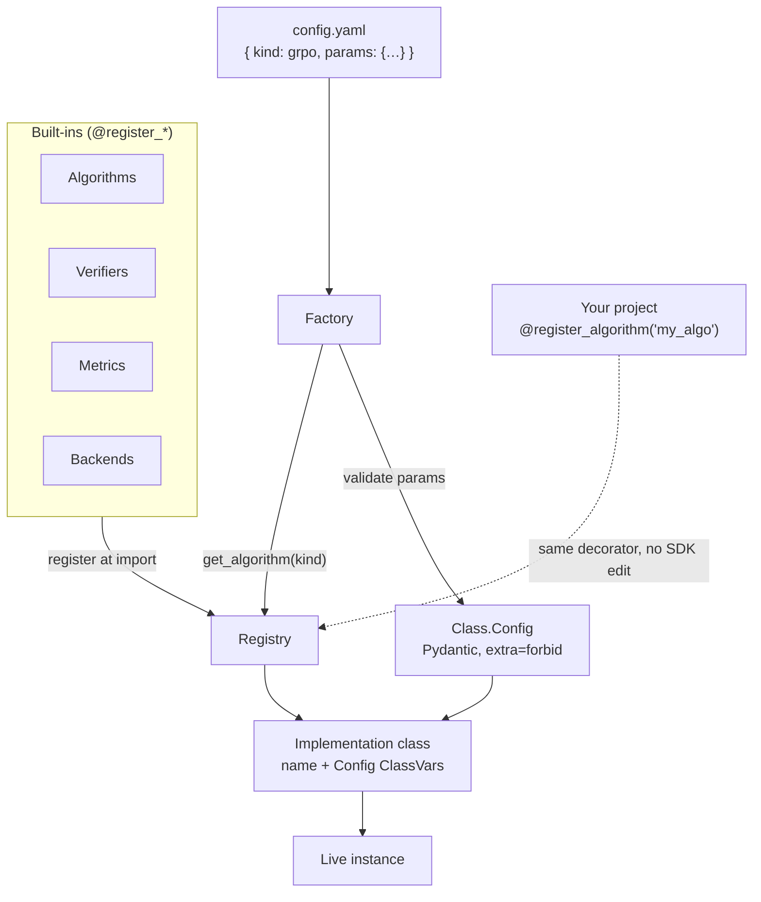

The recurring pattern across the whole SDK: **implement a protocol → register
it under a `kind` → reference it in YAML.** No subclassing the library, no
fork. Researchers register their own with the same decorator in their own
project.



## The four-step contract

<Steps>

<Step>

### A registry

Each extension *kind* has a `Registry("<kind>")` plus `register_<kind>` /
`get_<kind>` / `list_<kind>s` helpers.

</Step>

<Step>

### A class with two ClassVars

Every implementation carries a `name` (the string used in YAML) and a `Config`
(a Pydantic model, `extra="forbid"`) — decorated with `@register_<kind>("<name>")`.

```python
from pydantic import BaseModel
from evsys_sdk import register_algorithm

@register_algorithm("dpo")
class DPO:
    name = "dpo"

    class Config(BaseModel, extra="forbid"):
        beta: float = 0.1
```

</Step>

<Step>

### A YAML surface

A `<Kind>Spec` model shaped as `kind` + `params`, and a `list[<Kind>Spec]`
field on whatever config owns it.

</Step>

<Step>

### A factory

Resolves specs into instances: look up the class via `get_<kind>(spec.kind)`,
validate `spec.params` against the class's `Config`, then construct.

</Step>

</Steps>

## The eight registries

One registry per extension point. The YAML `kind` resolves into it.

| Registry | Decorator | `kind` used in |
|---|---|---|
| algorithm | `@register_algorithm` | `run.algorithm.kind` |
| backend | `@register_backend` | `run.backend.kind` |
| transform | `@register_transform` | `data.transforms[].kind` |
| data_store | `@register_data_store` | `data_store.kind` |
| log_store | `@register_log_store` | `log_store.kind` |
| metric | `@register_metric` | `eval.metrics[]` / `validation.metrics[]` |
| verifier | `@register_verifier` | verifier specs / RL reward |
| inference_client | `@register_inference` | `eval.inference.kind` |

## The payoff

Enable a feature from `config.yaml`:

```yaml
algorithm:
  kind: dpo
  params:
    beta: 0.1
```

…and register your own with the same decorator — or ship it in a third-party
package via entry points (group `evsys_sdk.<plural>`). The whole surface stays
predictable.

See the [registry API](/docs/evsys_sdk/registry) and the
[SDK Reference](/docs/reference) for every built-in kind.
