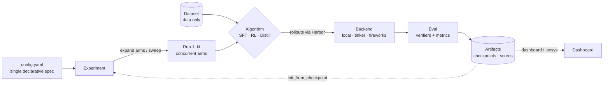

`evsys-sdk` is a declarative framework for LLM training experiments — **SFT,
RL, and distillation driven by a single YAML**, with a registry pattern for
pluggable algorithms, verifiers, metrics, and backends. It runs on
[Harbor](/docs/concepts/algorithms) for rollouts and pushes results to the
EvolvingSystems dashboard.

The whole mental model is one line:

> **`config.yaml` → `Experiment` → arms → backend → eval → artifacts**



## See it

A complete experiment is one file plus one command:

```yaml title="config.yaml"
name: sft-smoke-test
run:
  data:
    source: { kind: jsonl, params: { path: data/train.jsonl } }
    transforms: [{ kind: jsonl_to_chat }]
  model: { name: meta-llama/Llama-3.2-1B }
  algorithm: { kind: sft, params: { epochs: 1, lr: 2.0e-5 } }
  backend: { kind: mock }
```

```bash
evsys validate config.yaml --deep
evsys run config.yaml
```

## Start here

<Cards>
  <Card title="🚀 Quickstart" href="/docs/quickstart">
    Train your first model in 5 minutes — no GPU, no network.
  </Card>
  <Card title="📐 Architecture" href="/docs/concepts/architecture">
    The whole system on one screen, then drill into each layer.
  </Card>
  <Card title="🧩 Extensibility" href="/docs/concepts/extensibility">
    Register your own algorithm/verifier/backend — no fork.
  </Card>
  <Card title="📖 API reference" href="/docs/evsys_sdk">
    263 pages auto-generated from the code, always in sync.
  </Card>
</Cards>

## Why evsys-sdk

<Cards>
  <Card title="One YAML drives everything">
    `evsys run experiments/sft.yaml` — one file expands into a whole campaign
    of runs via `matrix`.
  </Card>
  <Card title="Pluggable by design">
    Eight registries. Add a method with `@register_algorithm("dpo")` — see
    [Extensibility](/docs/concepts/extensibility).
  </Card>
  <Card title="SFT · RL · distillation">
    One tool, one config shape, three training paradigms.
  </Card>
  <Card title="Local or hosted">
    `mock` for tests, `local` for TRL+peft on your GPU, `tinker` for hosted.
  </Card>
</Cards>

<Callout title="Built for LLMs too">
Every page is available as clean Markdown — append nothing or use the **Copy
Markdown** button, and see [`/llms.txt`](/llms.txt) and
[`/llms-full.txt`](/llms-full.txt) for the whole corpus in one file.
</Callout>
